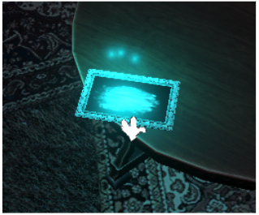
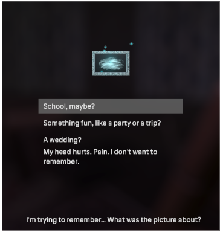
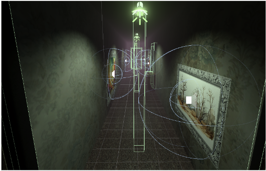

# Traummacher

*Project Date: Winter 2023*

## Summary

https://github.com/sfremann/Traummacher/assets/156663748/d2997ea4-2e51-4fcf-95b6-78f3a2879c54

“What happened? I can’t remember. I think I lost something… or someone.” 

Play as an amnesiac character, explore their apartment to help them retrieve their memories of loss and face grief. Your choices will influence their memories, and their past.

## Concept

_Traummacher_ is an immersive experience in a 3D environment following a character suffering from amnesia after the loss of a loved one. By putting themselves in the shoes of this character, the player can gradually help them retrieve their memories and face their grief. The experience is very metaphorical and pictorial, and is therefore subject to interpretation.

_Traummacher_ is a small game developed as part of a course on media and interactivity in winter 2023 at our university _Université de Technologie de Compiègne_. Our idea was to broach the topic of grief through an immersive game where the player's choices would impact the character's past history. We wanted to create an immersive experience with dreamlike sequences, using sound and visual ambiance to deliver the story and trigger emotions.

> [!NOTE]  
> Being a university project this experience is not 100% finished nor optimised.

> [!NOTE] 
> We also made a VR experience based on the same topic using most of this project's assets but with differences in gameplay and storytelling: [*Träumer*](https://github.com/sfremann/Traumer)

---

## Credits

- [Sarah Frémann](https://github.com/sfremann)
- [Victor Billaud](https://github.com/victr-bld)

### ◻️ Design & Writing
  
- **Scenario:** Sarah Frémann & Victor Billaud
- **Level design:** Sarah Frémann & Victor Billaud
- **Branching narrative:** Sarah Frémann & Victor Billaud

### ◻️ Programming & Engineering

- **Player input (movement & choice):** mostly Victor Billaud with help from Sarah Frémann
- **Environment mechanics:** mostly Sarah Frémann with help from Victor Billaud
- **Project architecture, integration & debug:** mostly Sarah Frémann with help from Victor Billaud

### ◻️ Visuals

- **VFX, light, environment & camera effects:** Sarah Frémann

### ◻️ Audio 

- **Sound selection:** mostly Victor Billaud with help from Sarah Frémann
- **Sound integration:** Sarah Frémann & Victor Billaud

> [!NOTE] 
> Technologies & resources: Unity 2021.3.25, Audacity, paint.net, Ink, Blender, DaVinci Resolve.

> [!NOTE] 
> Most models and sounds are free-to-use assets we found on Unity Asset Store, Pixabay, Sketchfab, Poly Haven. 

---

## How to use

### ◻️ Gameplay

The game is developed for Windows using a mouse and a keyboard. 

You can move inside the game using `ZQSD`. You can reorient the camera with the mouse. 

A blue glow will show when it is possible to interact with an object. When you are close enough to an interactible object a hand cursor will appear and you will be able to interact with a mouse `left click`. Then text related to the object will be displayed, sometimes a special menu will appear giving the player a choice to make. Use directional up and down arrow keys to navigate between the possibilities in the menu and press Enter to validate your choice. The options you pick will have an impact on the character's past. After making a choice the door to the next room will open and you can continue your way into the game.

If you press `Esc` you will have the possibility to close the game or resume playing.

### ◻️ Developer Note

https://github.com/sfremann/Traummacher/assets/156663748/0563181e-b66a-4ec3-bed4-d797d33ea1e9

The project is divided into rooms. The only active room is the one the user is currently in. Transitions between rooms is handled through movement and triggers. When the user enters another room, the door closes and the previous room is disabled.

Some other interactions and transitions are handled the same way. Below for example, when the user passes below the light, it buzzes.

Interaction with glowing objects will usually trigger a dreamlike sequence.

---
