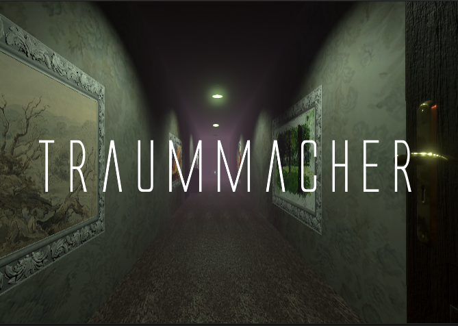

# Traummacher

## Summary

Traummacher is an immersive experience in a 3D environment where the player embodies a character suffering from amnesia regarding the loss of a loved one. By putting themselves in the shoes of this character, the player can gradually discover their memories and remember with them the origin and nature of their grief.

The experience is very metaphorical and pictorial, and is therefore subject to interpretation.

Note: being a university project this experience is not 100% finished nor optimised.

---

## Credits

### Design & Writing

- Scenario: Sarah Frémann & Victor Billaud
- Design of the appartment: Sarah Frémann & Victor Billaud

### Programming & Engineering

- Basic gameplay/ direct interaction: mostly Victor Billaud with help from Sarah Frémann
- More complex interaction: Sarah Frémann & Victor Billaud
- Environment behavior: mostly Sarah Frémann with help from Victor Billaud
- Putting things together/ Solving conflict: mostly Sarah Frémann with help from Victor Billaud
- Testing/ Debug: Sarah Frémann & Victor Billaud

### Visuals

- Effects & transitions / shaders: Sarah Frémann
- Environment & light: Sarah Frémann

### Audio 

- Sound selection: mostly Victor Billaud with help from Sarah Frémann
- Effects & transitions: Sarah Frémann & Victor Billaud

---

## Concept

*Traummacher* is a small game developed as part of a course on media and interactivity in winter 2023 at our university *Université de Technologie de Compiègne*. 

Our idea was to broach the topic of grief through an immersive game where the player's choices would impact the character's past history. We wanted to create an immersive experience with dreamlike sequences, using sound and visual ambiance to accompany the development of the story and introduce feelings.

---

## Technologies & ressources

- Unity 2021.3.25
- Audacity
- paint.net
- Inky
- Blender

Most models and sounds are free-to-use assets we found on Unity Asset Store, Pixabay, Sketchfab, Poly Haven. 

---

## How to use

The game is developed for Windows using a mouse and a keyboard. 

You can move inside the game using ZQSD. You can reorient the camera with the mouse. 

A blue glow will show when it is possible to interact with an object. When you are close enough to an interactible object a hand cursor will appear and you will be able to interact with a mouse left click. Then text related to the object will be displayed, sometimes a special menu will appear giving the player a choice to make. Use directional up and down arrow keys to navigate between the possibilities in the menu and press Enter to validate your choice. The options you pick will have an impact on the character's past. After making a choice the door to the next room will open and you can continue your way into the game.

If you press Esc you will have the possibility to close the game or resume playing.

---

## Related Work

VR experience based on the same topic using most of this project's assets but with differences in gameplay and storytelling: https://github.com/sfremann/Traumer
